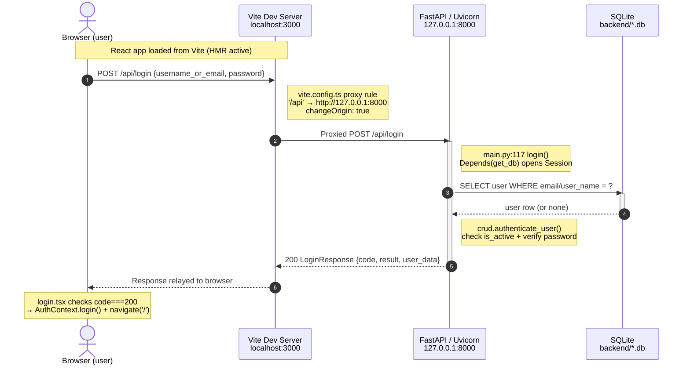
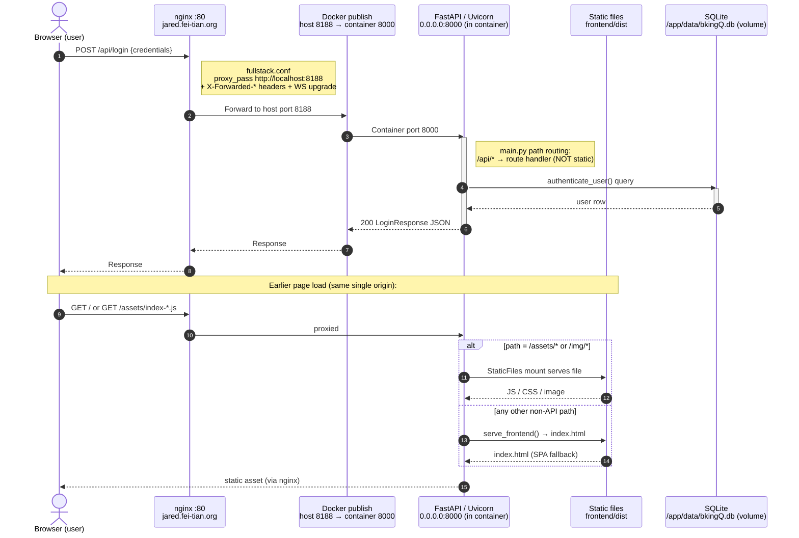
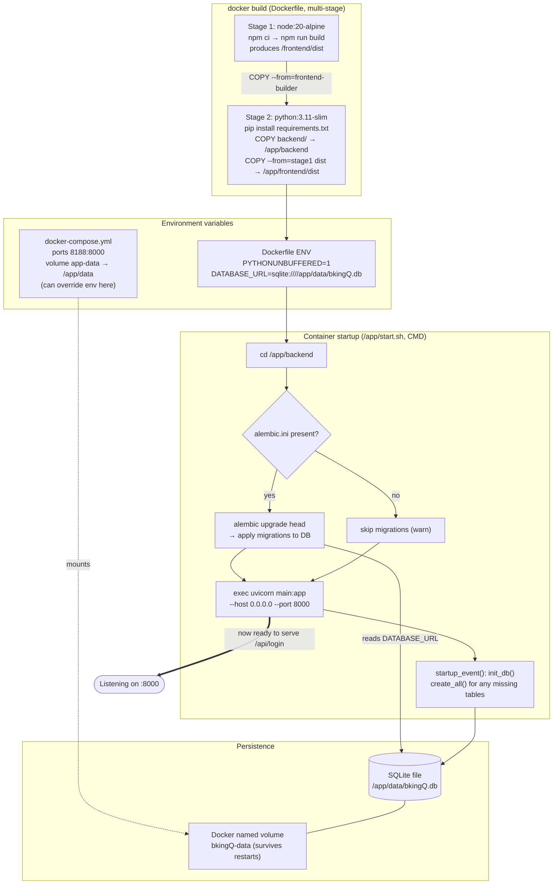
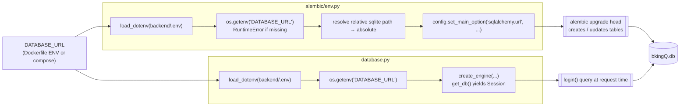

# How `/api/login` Flows Through All 3 Tiers

This document traces a single request — a user submitting the **Login** form — across the
**frontend** (React + Vite), the **backend** (FastAPI), and the **database** (SQLite via
SQLAlchemy). Three diagrams show three different runtime contexts.

Key source files referenced throughout:

| Tier | File | Role |
|------|------|------|
| Frontend | [login.tsx](../frontend/src/pages/login.tsx) | Form + submit handler |
| Frontend | [api.ts](../frontend/src/services/api.ts#L185) | `loginUser()` axios call |
| Frontend | [vite.config.ts](../frontend/vite.config.ts) | Dev proxy `/api` → `:8000` |
| Backend | [main.py:117](../backend/main.py#L117) | `POST /api/login` route |
| Backend | [database.py](../backend/database.py) | `get_db()` session, engine |
| Backend | [crud.py:381](../backend/models/crud.py#L381) | `authenticate_user()` |
| Infra | [Dockerfile](../Dockerfile) | Multi-stage build + migrations |
| Infra | [fullstack.conf](../backend/fullstack.conf) | nginx reverse proxy |

---

## Diagram 1 — Development Mode (Vite dev server + proxy)

In dev, **two** processes run: the Vite dev server on **port 3000** (serves React with
hot reload) and Uvicorn/FastAPI on **port 8000**. The browser only ever talks to port 3000.
Vite's proxy intercepts any path starting with `/api` (and `/ws`) and forwards it to the
backend on `127.0.0.1:8000`. This sidesteps CORS because the browser thinks everything is
same-origin (`localhost:3000`).

**Why the proxy matters:** without it the browser at `:3000` calling `:8000` directly is a
cross-origin request. The proxy keeps the request same-origin and forwards server-side.
(Note: `api.ts` falls back to `http://localhost:8000` in dev only if `VITE_API_URL` is unset;
the proxy path is the clean default.)

---

## Diagram 2 — Production Mode (nginx → Docker → FastAPI serves static)

In production there is **one** application process. The frontend is **pre-built** into static
files (`frontend/dist`) and FastAPI serves them directly — no Vite, no separate frontend
server. nginx sits in front as a reverse proxy on port **80**, forwarding everything to the
Docker container published on host port **8188**, which maps to container port **8000**.

FastAPI decides per-path: `/api/*` and `/ws/*` hit route handlers; `/assets/*` and `/img/*`
are mounted static dirs; everything else falls through to `serve_frontend()` which returns
`index.html` (SPA fallback for React Router).

**Static mounting (main.py:313-340):** on startup FastAPI checks if `frontend/dist` exists.
If so it `app.mount("/assets", StaticFiles(...))` and `/img`, then registers a catch-all
`GET /{full_path:path}` that serves real files or falls back to `index.html`. Route order
matters — the `/api/...` handlers are declared *before* the catch-all, so API calls never
get swallowed by the SPA fallback.

---

## Diagram 3 — Docker Build & Startup (env vars + Alembic migration)

This shows how the image is built and what happens when the container boots — **before** any
`/api/login` request can be served. Two build stages: Node builds the frontend, then the
Python image copies that build output in alongside the backend.

### How `DATABASE_URL` reaches Alembic and the app

**Migration timing:** Alembic runs **once at container startup** (`alembic upgrade head` in
`start.sh`), bringing the schema to the latest revision *before* Uvicorn starts accepting
traffic. Both Alembic (`env.py`) and the running app (`database.py`) read the **same**
`DATABASE_URL` env var and apply the **same** relative→absolute SQLite path resolution, so
they always point at the identical DB file inside the `app-data` volume. `init_db()` in
`startup_event` is a safety net (`create_all`) — Alembic is the source of truth for schema.

---

## One-line summary per tier

- **Frontend** — `login.tsx` form → `loginUser()` in `api.ts` → `POST /api/login`. In dev the
  request goes through Vite's proxy; in prod through nginx. Same JS code, different transport.
- **Backend** — `main.py:117` `login()` opens a DB session via `Depends(get_db)`, delegates to
  `crud.authenticate_user()`, returns a `LoginResponse` (always 200 envelope with inner `code`).
- **Database** — SQLAlchemy `Session` runs a `SELECT` on the user table in the SQLite file,
  which lives in the persistent `app-data` volume and was schema-migrated by Alembic at boot.
